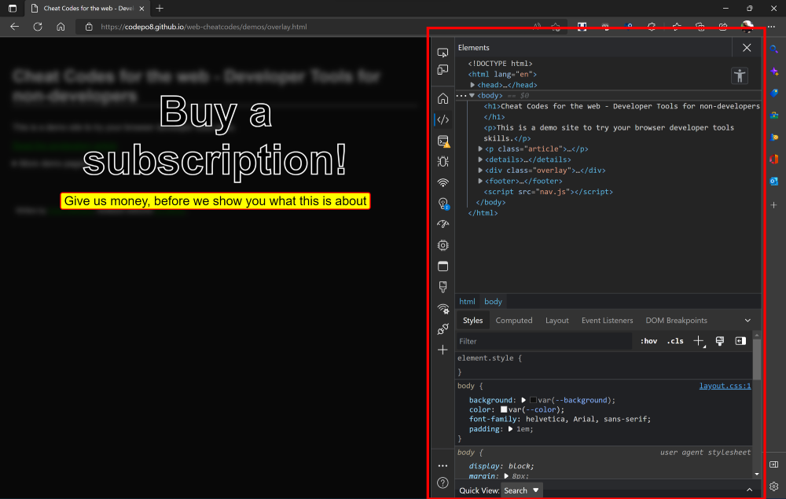

# Cheat codes for the web

## Browser developer tools for non-developers

Every browser these days comes with built-in developer tools that help people create, test and fix products for the web. You can right-click any website and select `Inspect` to get to them, press `F12` or `CMD + Shift + I on Mac` or `Ctrl + Shift + I` on Windows/Linux. 

These tools are for developers, but they can also help you to fix some annoyances of the web. This here is a collection of ways to make the web less annoying for you by using these tools. 

I work on these tools as a product manager and daily I get about 20 - 30 feedback messages that people opened them accidentally and are sure they "have been hacked".

I get it - to non developers these tools look daunting and complex and all the errors they display can be intimidating and worrying. And that annoys me. Tooling for the web shouldn't require you to be an expert. On the contrary - the more you use these tools, the more you should become an expert of the web. 

> This is why I put together this collection with demonstrations for you to see what developer tools can be: **your cheat codes for the web**.

When I look at the web as a whole and especially, let's call them "fringe content" web sites, I am disappointed at how we use this medium. Instead of giving people content they came for, we smother intrusive ads all over, prevent people from using the context menu which is full of accessibility enhancing tools and make people jump through hoops just to get to some content they found in a search engine.

Now I will show you how you can use the browser developer tools to work around some of these annoyances. 

> As the browser of choice I use Microsoft Edge, because it comes for free on any Windows machine, is available for all other platforms, and I work on it. You're free to use whatever you want, and most of the functionality should also be available in other browsers. 

Another important reminder is that you are not doing anything illegal here nor can you get traced by the products you change to your needs.

> Everything you do in these tools happens on your computer. You do not change the live product and if you reload it, your changes are gone, too.

Here are the tasks and how to do them with browser developer tools:

* [Remove annoying overlays and page elements](overlays.md)
* [Take screenshots of web content](screenshots.md)
* [Inspect the uninspectable](inspect-no-context.md)
* [Get back the context menu](context-menu.md)
* [Avoid unwanted redirects](remove-redirects.md)
* [Get a simpler video player](videoplayer.md)
* [Download images](download-images.md)
* [Get the mobile version of the current document](mobile.md)
* [Check the document in different modes](page-modes.md)
* [Making timed buttons work without waiting](timed-buttons.md)

Do you have some other task you'd like to know how to achieve it? Do you have a recipe you use yourself? Comment in an issue on the [GitHub Repository](https://github.com/codepo8/web-cheatcodes) of this or [ping me on Twitter](https://twitter.com/codepo8).
