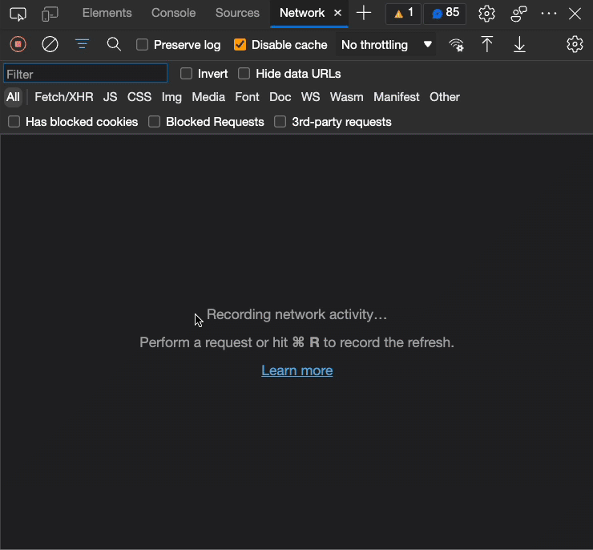
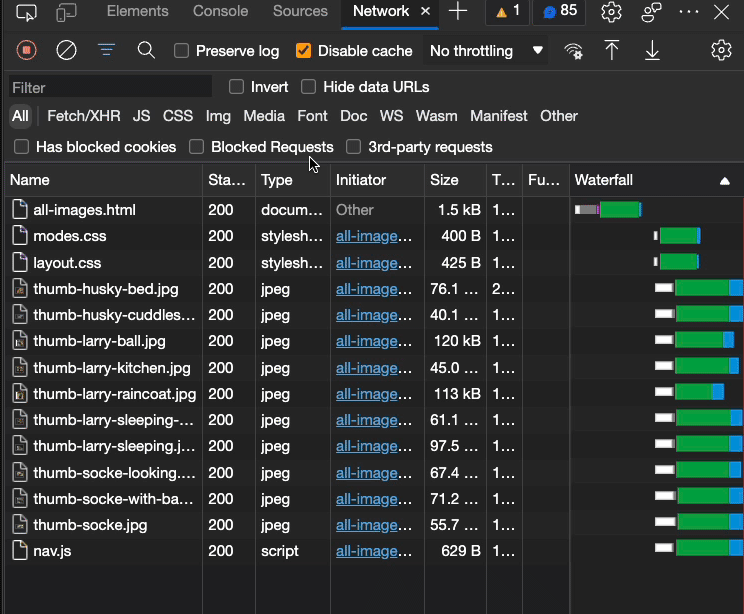
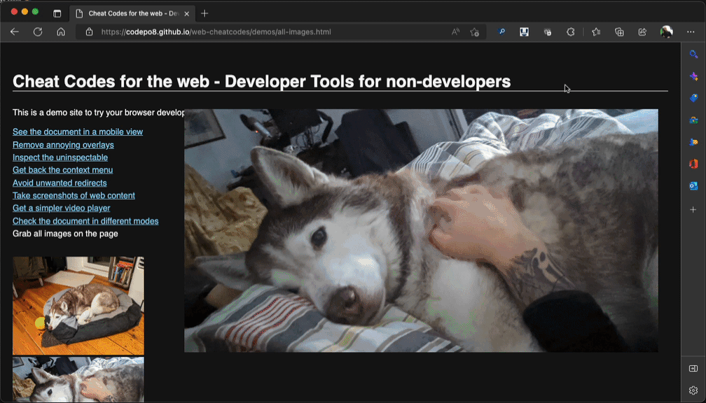

# Download all images

Take the [demo page containing an image gallery](https://codepo8.github.io/web-cheatcodes/demos/all-images.html) for example. 

Now, in many cases of sites like these you can use the [Network tool](https://docs.microsoft.com/microsoft-edge/devtools-guide-chromium/network/) of browser developer tools to get access to all the images that are scattered throughout the document or even loaded in the background.

1. [Open Developer Tools](https://docs.microsoft.com/microsoft-edge/devtools-guide-chromium/overview#open-devtools) by pressing F12.
1. If the Network tool isn't avaible yet, press the `+` button, select the `Network` tool and reload the page.
    
1. The Network Tool now shows all the content that was and is still being loaded
    
1. Click the `Img` option to filter the list to only see image files
    
1. Click on any of the images in the list to see a preview of it.
1. Right-click on the image to be able to copy the image, open it in a new tab or save it.

You can see this in action on the demo page in the following recording:

You can use the Network tool for a lot more things, for example to [get a simpler player control for videos](videoplayer.md).

* [Back to list of all cheat codes](README.md)
