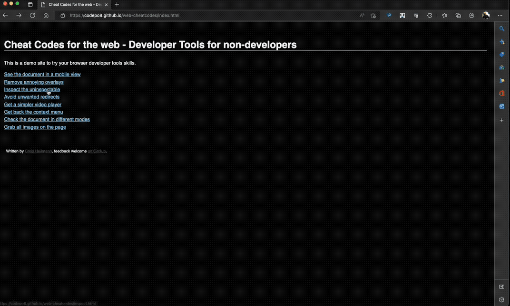

# Inspect the uninspectable

Web site maintainers are aware of the power of developer tools and try to block functionality. That's why some web sites will redirect you when you try to right-click and inspect them.

You can try this in the [example page to block inspection](https://codepo8.github.io/web-cheatcodes/demos/inspect.html). When you right-click this one, it redirects you to [example.com](https://example.com).

That's why it is always a safer bet to first [open the Developer tools](https://docs.microsoft.com/microsoft-edge/devtools-guide-chromium/overview#open-devtools) by pressing F12 and pick what you want to change using [the Inspect Tool](https://docs.microsoft.com/microsoft-edge/devtools-guide-chromium/css/inspect) instead by clicking the pointer icon.

* [Back to list of all cheat codes](README.md)