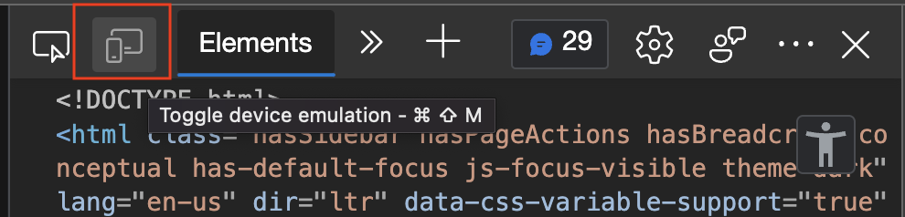
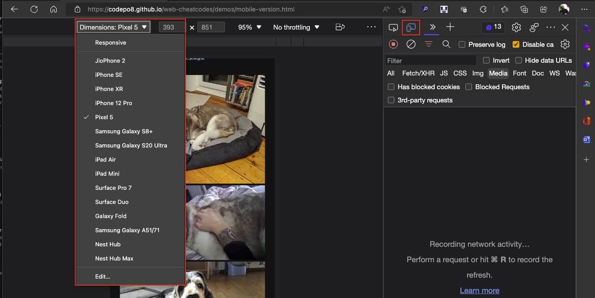
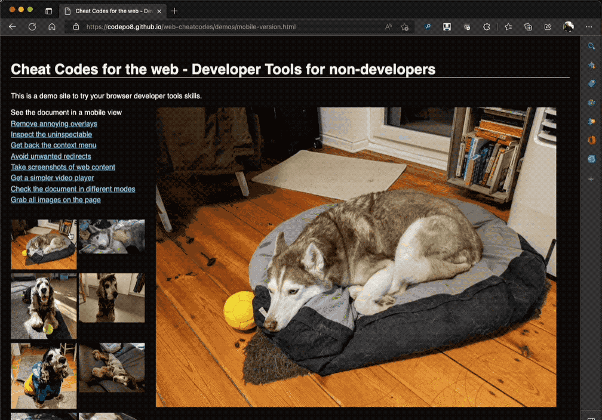
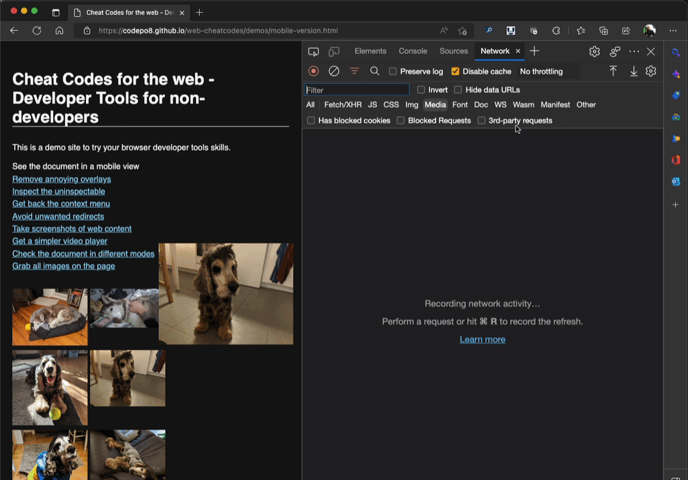

# Get     the mobile version of the current document

Often the mobile version of a web site is much simpler and has fewer annoying popups, redirects and advertising. Some web sites also only allow content uploads from mobile apps. That's why you can use the browser device emulation to trick the site into thinking that you are using a mobile device.

1. [Open Developer Tools](https://docs.microsoft.com/microsoft-edge/devtools-guide-chromium/overview#open-devtools) by pressing F12.
1. Click the [device emulation](https://docs.microsoft.com/microsoft-edge/devtools-guide-chromium/device-mode/) button
    
1. Select from a different emulated device
    

You can try this out and see the difference in [this mobile version demo page](https://codepo8.github.io/web-cheatcodes/demos/mobile-version.html). It is a multi step process to see (or download) an image in the normal version of the site.

The mobile version simply shows all of them in a larger size allowing you to right-click and save them.

Often the mobile version of the site also has simpler video players. You can then right-click videos and select `save video as` or `show controls` to navigate the video. If you encounter really annoying video players, you can also try the [get a simpler video player trick](videoplayer.md).

Another interesting feature of this mode is that you can [spoof a different geographical location](https://docs.microsoft.com/en-us/microsoft-edge/devtools-guide-chromium/device-mode/#override-geolocation) but most sites will not fall for that and show you content specific to this locale. For that you'd need a VPN.

* [Back to list of all cheat codes](README.md)