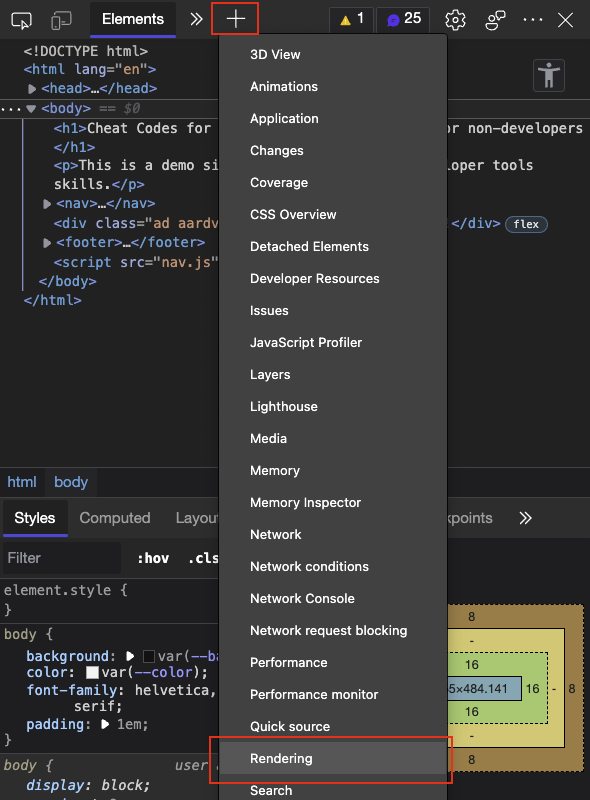

# Check the document in different modes - print, dark and light

Operating systems have ways to allow users to customise the experience to their needs. You can choose a dark or a light mode, some users even need a high contrast mode to find their way around and others need to have animations turned off. Another mode that most web sites should have is a print mode. This one is often much simpler than the full design and thus might be easier to consume. While it is great that you can do that on a device level, sometimes you find that the experience offered by a web product in a certain mode isn't what you want. 

Instead of having to change your operating system settings, you can simulate these environmental changes using developers tools.

You can use the [Rendering tool](https://docs.microsoft.com/microsoft-edge/devtools-guide-chromium/accessibility/preferred-color-scheme-simulation) of browser developer tools to simulate these different modes. You can: 

* Switch the dark/light mode of the current document to the opposite
* Show the page as a print version without having to print it
* Turn off animations by simulation reduced motion
* See the page in high contrast (forced colours) mode

Granted, these are much more useful for testers to see how a product works in these modes, but sometimes it can also help to turn off a lot of annoyances in web products. To try this out you need to:

1. Press the `+` button to go to the `Rendering` tool if it isn't available yet.
    
1. Scroll down to the different mode emulation dropdown and turn them off or on
    

You can see this in action in the following screencast and you can try it on the [page modes demo](https://codepo8.github.io/web-cheatcodes/demos/modes.html) yourself.

* [Back to list of all cheat codes](README.md)
