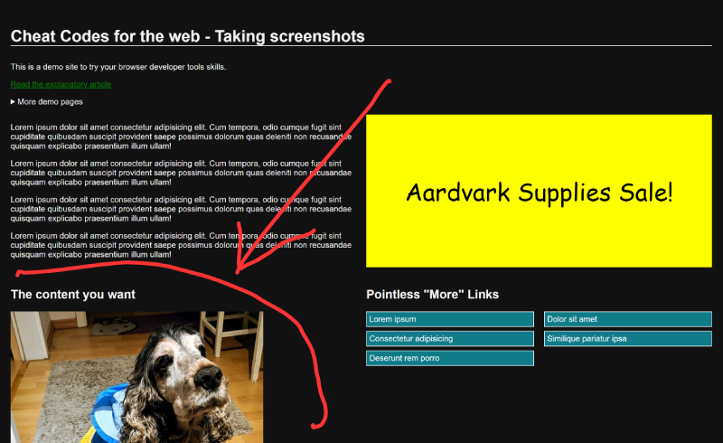
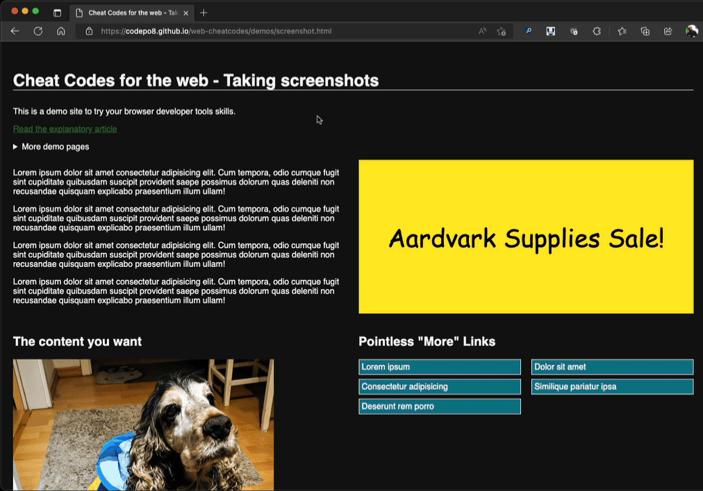
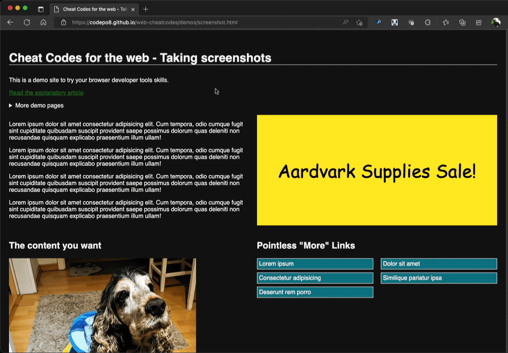
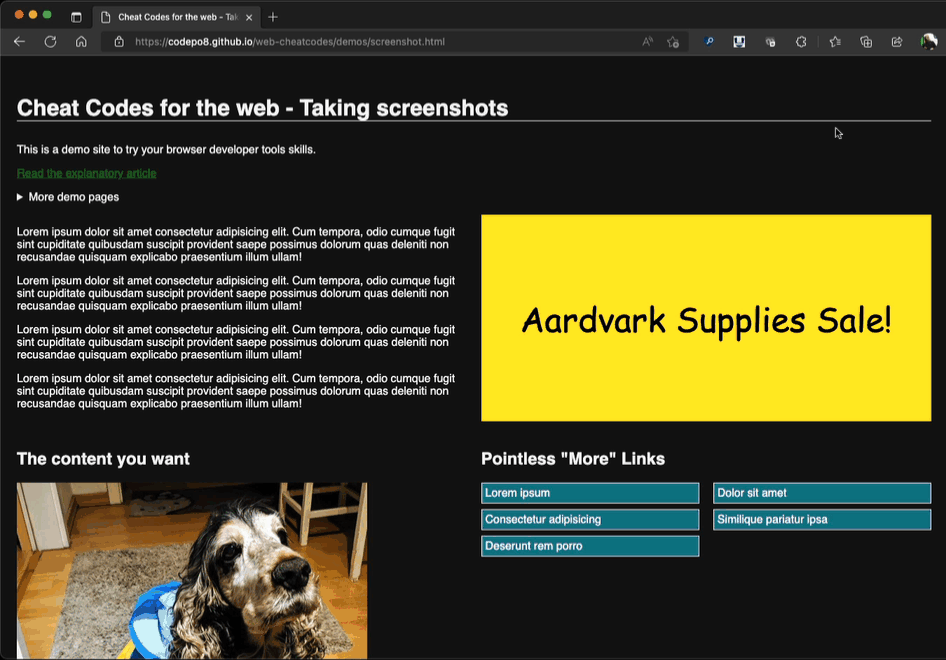

# Take screenshots of web content

Operating systems and browsers come with built-in tools to take screenshots. Often it is tricky though to only take a picture of what you want as there is a lot on the screen you don't want. And selecting a certain part of a document can be finicky.

Take the [screenshot demo page](https://codepo8.github.io/web-cheatcodes/demos/screenshot.html) for example. I added a fake ad, useless "more" links and ensured that the bit you really want (the dog, of course) is something you need to scroll to.

Microsoft Edge comes with a built-in screenshot tool called Web Capture. You can enable it by hitting `Ctrl` + `Shift` + `S` on your keyboard (on Mac it is `Cmd` instead of `Ctrl`). This allows you to select the part of the screen you want to copy as an image.

You can also choose to take a picture of the whole document, which automatically scrolls all the way down for you and returns a picture to save or edit.

The first option could be tough to get right with elements that don't have much whitespace around them and the second option means you need to cut out what you need with another tool.

There are two ways to use browser developer tools to create screenshots of just the thing you want. One is to select it and use the `node screenshot` option, the other to delete what you don't want. Let's start with the deletion trick which you can also use to [remove annoying overlays](overlays.md):

1. [Open Developer Tools](https://docs.microsoft.com/microsoft-edge/devtools-guide-chromium/overview#open-devtools) by pressing F12.
1. Use the [Inspect Tool](https://docs.microsoft.com/microsoft-edge/devtools-guide-chromium/css/inspect) by clicking the pointer icon to pick an element of the page
    
1. Move your mouse around the document and you will get coloured rectangles outlining the current page element.
1. Click your mouse and the element will get highlighted in the Elements tool.
1. Press `Delete` to remove it

Once you are in the Elements tool, you can also use the arrow keys to move around to delete other, unneccesary page elements. You can see this in action in the following recording:

The other way to take a screenshot of what you want to have is to be more surgical and pick the element.

1. [Open Developer Tools](https://docs.microsoft.com/microsoft-edge/devtools-guide-chromium/overview#open-devtools) by pressing F12.
1. Use the [Inspect Tool](https://docs.microsoft.com/microsoft-edge/devtools-guide-chromium/css/inspect) by clicking the pointer icon to pick an element of the page
    
1. Move your mouse around the document until the element you want to take a screenshot of is covered by a coloured rectangle.
1. Click your mouse and the element will get highlighted in the Elements tool.
1. Select the `...` menu on the line of the highlighted the element (or right-click the highlighted element)
1. Choose `Capture Node Screenshot`

The "Capture Node Screenshot" trick also works on videos that don't allow you to take screenshots like those on many streaming services.

* [Back to list of all cheat codes](README.md)
