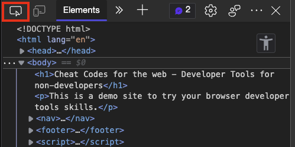

# Making timed buttons work without waiting

Often you will find that some web sites make you wait a certain amount of time before you can interact with - for example - a download button. This is to show you more ads but also to make the free version of the site annoying enough to get you to buy a subscription. In many cases these buttons are just disabled and get enabled when the time is up. Using developer tools, it is often possible to take a shortcut and remove the disabled attribute, thus making the button clickable.

Here's how to get rid of overlays using the browser developer tools. You can try it out yourself on the [example page with a timed button](https://codepo8.github.io/web-cheatcodes/demos/timed-button.html).

1. [Open Developer Tools](https://docs.microsoft.com/microsoft-edge/devtools-guide-chromium/overview#open-devtools) by pressing F12.
1. Use the [Inspect Tool](https://docs.microsoft.com/microsoft-edge/devtools-guide-chromium/css/inspect) by clicking the pointer icon to pick an element of the page
    
1. Move your mouse around the document until the button in question is covered by a colour overlay
1. Click your mouse and the element will get highlighted in the Elements tool.
1. Double click on the `disabled` attribute of the button element
1. Press `Delete` to remove it

You can see it in action in this recording:

* [Back to list of all cheat codes](README.md)