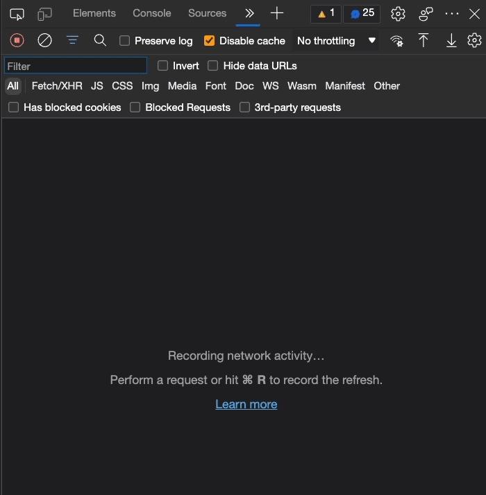
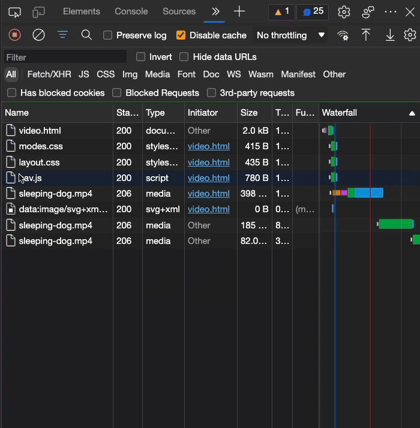
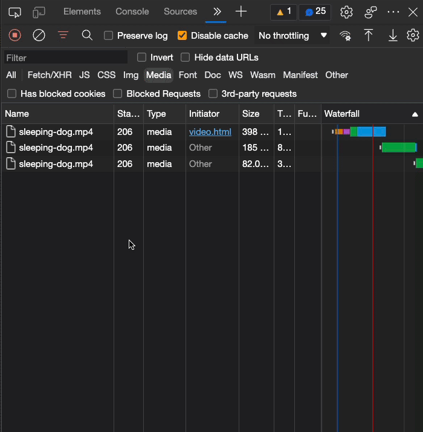
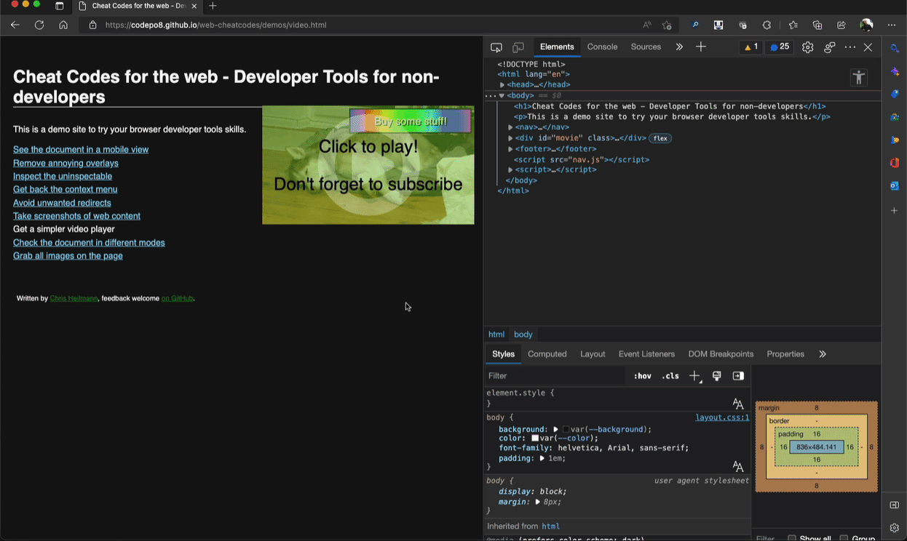

# Get a simpler video player

Every since the demise of Flash, using video on the web has become a lot easier. You can control videos with in-built player controls and you can right-click and save any video. That, of course, is not necessarily what publishers of videos want. That's why there are ways to protect videos from donwloading, and that's OK.

What is less OK is if a web site deliberately makes it harder to watch a video because they want to cover it with things that track your clicks or make you press buttons to fire up other functionality in the background.

Take the [demo page of an annoying video embed](https://codepo8.github.io/web-cheatcodes/demos/video.html) for example. I've done my best to make it really annoying to see a video of a sleeping dog.

Now, in many cases of sites like these you can use the [Network tool](https://docs.microsoft.com/microsoft-edge/devtools-guide-chromium/network/) of browser developer tools to get a simpler version of the same video.

1. [Open Developer Tools](https://docs.microsoft.com/microsoft-edge/devtools-guide-chromium/overview#open-devtools) by pressing F12.
1. If the Network tool isn't avaible yet, press the `+` button, select the `Network` tool and reload the page.
    
1. The Network Tool now shows all the content that was and is still being loaded
    
1. Click the `Media` option to filter the list to only see movie files
    
1. Find the video you want to see. These are files ending in `.mp4` most of the time
1. Right-Click the file and select `Open in new tab`
    
1. You get the video using the full controls to play, save and control to your needs.

You can see this in action on the demo page in the following recording:

You can use the Network tool for a lot more things, for example to [download images](download-images.md).

* [Back to list of all cheat codes](README.md)
